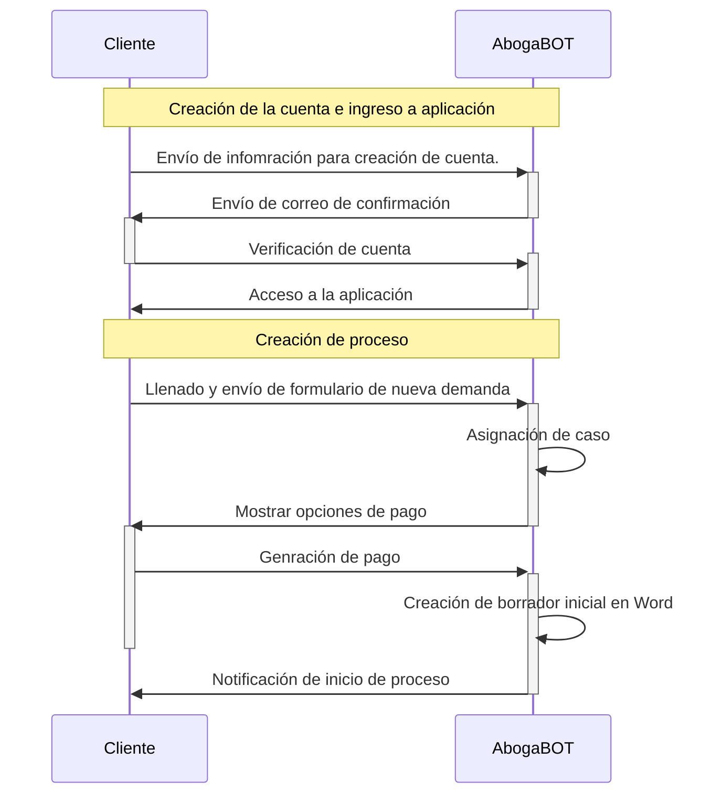

# Proceso para el inicio de un proceso

Para el inicio de un proceso se deberán seguir los siguientes pasos

```mermaid
sequenceDiagram
	participant c as Cliente
	participant a as AbogaBOT
	Note over a, c: Creación de la cuenta e ingreso a aplicación
	c ->>+ a: Envío de infomración para creación de cuenta.
	a ->>- c: Envío de correo de confirmación
	activate c
	c ->>+ a: Verificación de cuenta
	deactivate c
	a ->>- c: Acceso a la aplicación
	
	Note over a, c: Creación de proceso
	c ->>+ a: Llenado y envío de formulario de nueva demanda
	a ->> a: Asignación de caso
	a ->>- c: Mostrar opciones de pago
	activate c
	c ->>+ a: Genración de pago
	a ->> a: Creación de borrador inicial en Word
	deactivate c
	a ->>- c: Notificación de inicio de proceso
		
	
```

